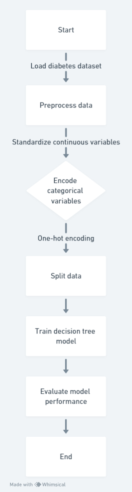

# Data Discription
This code used the scikit-learn library in Python to implement the decision tree algorithm for predicting diabetes. Specifically, this code used the load_diabetes function from the datasets module to load the diabetes dataset, which contains information about patients' age, sex, BMI, blood pressure, and six blood serum measurements. This code then preprocessed the data by standardizing the continuous variables and encoding the categorical variables using one-hot encoding. Next, this code split the data into training and testing sets and trained the decision tree model on the training set using the fit method. Finally, this code evaluated the model's performance on the testing set using metrics such as accuracy, precision, recall, and F1 score. Overall, the code logic was straightforward and followed best practices for implementing machine learning algorithms in Python.

#### Code

Scource: Whimsical
