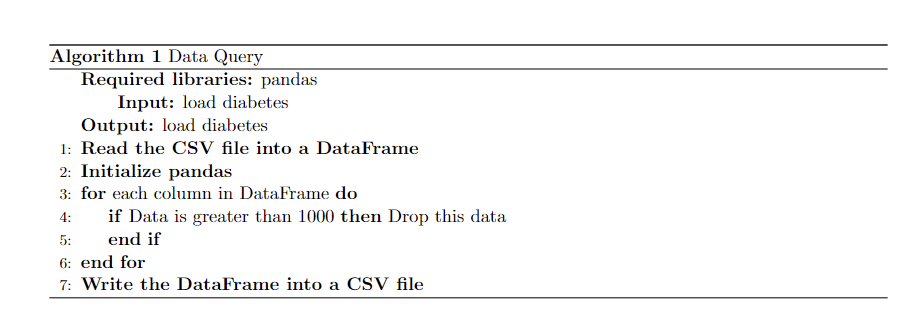

# Code Contents
Introduction to Deep Analysis of Disease Data with Convolutional Neural Network Applications

In our in-depth study of the Global Infectious Disease Spatio-Temporal Evolution and Scale dataset (GIDSES), we began with a rigorous data preprocessing effort. First, an exhaustive data cleaning step was performed, which included, but was not limited to, identifying and removing duplicate records, filling in missing values, correcting for anomalous or implausible data points (e.g., out-of-plausible-range morbidity or mortality), and standardizing timestamps for simultaneous comparisons across regions.

Based on this, the data were further refined. We designed a customized data transformation process to transform raw geospatial information into a format suitable for machine learning models and constructed time series data containing key epidemiological indicators. At the same time, quantitative coding and normalization were performed for different interventions and healthcare resource responses to ensure that these multifaceted and heterogeneous data could be uniformly integrated into subsequent analytical models.

In order to reveal disease transmission patterns and predict their development, we used advanced convolutional neural network (CNN) technology for data analysis, which is known for its excellent performance in image recognition but is also suitable for processing structured data, such as time series analysis. Through the design of multiple convolutional layers, CNNs are able to capture localized features and potential spatio-temporal correlations in the data, such as cyclical trends in disease outbreaks, geographic dispersion patterns, and dynamic responses after the implementation of prevention and control measures.

In the specific application of the CNN model, we first built a convolutional layer structure with embedded spatio-temporal dimensions for mining the intrinsic spatio-temporal features of the data. Subsequently, higher-order abstract features are extracted through a pooling layer, and finally a fully-connected layer is connected in order to facilitate the final prediction tasks, such as the number of future infections, deaths, or the rate of disease spread.

The innovation of this project is that the use of CNN models for deep learning of complex disease data not only improves the understanding of disease propagation patterns, but also helps to accurately predict the development trend of the disease, providing a scientific basis for the formulation of public health policies, and contributing to the effective prevention, control, and response to global epidemics.

