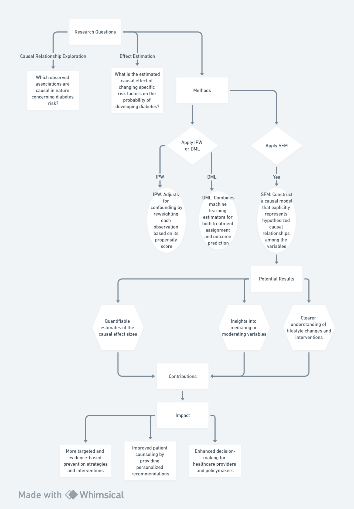

### Background/Motivation
While the current research project has effectively utilized machine learning techniques to predict diabetes risk, it primarily focuses on associations between variables. However, establishing causality among these factors is essential for designing effective interventions and public health policies. Causal inference methods can help us understand which variables directly cause an increased risk of diabetes and estimate the potential impact of modifying those factors.

### Research Questions
1. **Causal Relationship Exploration**: Which observed associations (e.g., age, BMI, glucose levels, blood pressure, and body fat percentage) are causal in nature concerning diabetes risk?
2. **Effect Estimation**: What is the estimated causal effect of changing specific risk factors on the probability of developing diabetes?

### Methods
We plan to apply state-of-the-art causal inference algorithms like **Inverse Probability Weighting (IPW)** ([Robins et al., 1994](https://www.ncbi.nlm.nih.gov/pmc/articles/PMC1044287/)) or **Double Machine Learning (DML)** ([Chernozhukov et al., 2018](https://arxiv.org/abs/1608.00060)), potentially using software packages such as `causalml` ([GitHub Documentation](https://github.com/uber/causalml)) or `DoWhy` ([GitHub Documentation](https://microsoft.github.io/dowhy/)). 

- **IPW**: This method adjusts for confounding by reweighting each observation based on its propensity score, i.e., the probability of exposure given the covariates.
  
- **DML**: Combines machine learning estimators for both treatment assignment and outcome prediction, allowing for more robust estimation of causal effects while controlling for high-dimensional confounders.

We would also consider applying **Structural Equation Modeling (SEM)** ([Bollen, 1989](https://psycnet.apa.org/record/1989-98043-001)) to construct a causal model that explicitly represents hypothesized causal relationships among the variables.

### Potential Results
The application of causal inference could lead to:
- Quantifiable estimates of the causal effect sizes for each identified risk factor.
- Insights into mediating or moderating variables that influence the relationship between a risk factor and diabetes incidence.
- A clearer understanding of the pathways through which lifestyle changes and interventions might affect diabetes risk.

### Contributions
Integrating causal inference will significantly enhance the intellectual merits of our work by moving beyond mere association towards a deeper understanding of causality in diabetes development. Practically, this would enable:
- More targeted and evidence-based prevention strategies and interventions.
- Improved patient counseling by providing personalized recommendations grounded in causal relationships.
- Enhanced decision-making for healthcare providers and policymakers, facilitating resource allocation and prioritization of preventive measures.

In summary, extending the current research with causal inference methodologies promises to uncover new insights into the drivers of diabetes risk and facilitate the translation of these findings into impactful interventions.

# Future Research
Flowchart: 

Source: Whimsical

# Causel Inference
Flowchart: 

Source: Whimsical

# Optimization Method
Flowchart: 

Source: Whimsical
