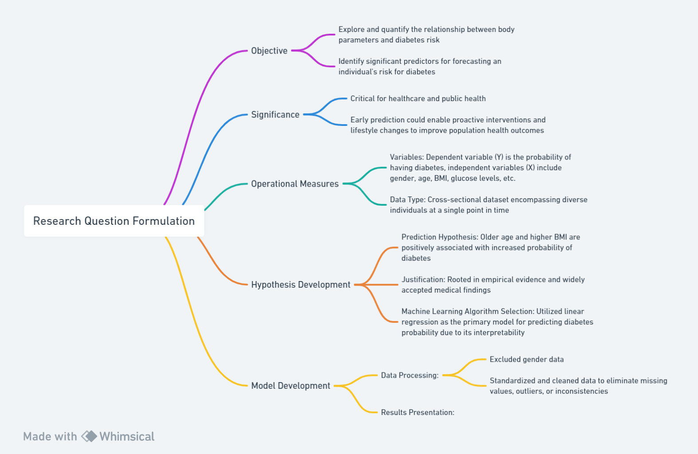

# Research Question Formulation:

- Objective: The specific research question addressed in this project aims to explore and quantify the relationship between various body parameters and the probability of developing diabetes, focusing on identifying significant predictors that can be used to forecast an individual's risk for the disease.

- Significance: This research question is critical in the field of healthcare and public health due to the growing prevalence and severity of diabetes as a global health concern. Early prediction based on accessible body parameters could enable proactive interventions and lifestyle changes, thereby mitigating the onset of diabetes and contributing to improved population health outcomes. 

### Operational Measures:
- Variables: In this study, the dependent variable (Y) is the probability of having diabetes, while the independent variables (X) are a set of nine key body parameters including gender, age, Body Mass Index (BMI), glucose levels, among others.

- Data Type: The dataset employed in this analysis is cross-sectional, encompassing a diverse range of individuals with different characteristics at a single point in time.

### Hypothesis Development:
- Prediction Hypothesis: Based on existing medical literature and data from the National Diabetes Data Group (US), the hypothesis posits that older age and higher BMI are positively associated with an increased probability of diabetes. Specifically, it is hypothesized that as age increases and BMI rises, so does the likelihood of an individual being diagnosed with diabetes.

- Justification: This hypothesis is rooted in empirical evidence (National Diabetes Data Group, 1995) and widely accepted medical findings that suggest aging and obesity are major risk factors for type 2 diabetes. Age-related physiological changes and the correlation between obesity and insulin resistance provide strong scientific rationale for these proposed relationships.

- Machine Learning Algorithm Selection: To test this hypothesis, multiple machine learning algorithms have been utilized, including linear regression, XGBoost, and Support Vector Machines (SVM). Ultimately, linear regression was chosen as the primary model for predicting diabetes probability due to its interpretability and suitability for understanding the linear relationships between the continuous independent variables and the continuous dependent variable. Additionally, given the nature of the hypothesis and the assumption of a potentially linear association between the body parameters and diabetes risk, linear regression offers a straightforward and effective method for estimating the magnitude of these associations.

# The Machine Learning Workflow

### Model Development:
- Data Processing: To ensure the data met the analysis requirements, this study decided to exclude gender data and instead focus on a unified analysis of the remaining continuous variables. The rationale for removing gender was likely due to its categorical nature or potential insignificance in the initial hypothesis. All data were standardized and cleaned to eliminate missing values, outliers, or inconsistencies. 

During preprocessing, the dataset was split into training and testing sets at an 80% to 20% ratio, ensuring that the model's performance could be accurately gauged on unseen data.
### Results Presentation:
- Training and Testing: After model development, the predicted diabetes probabilities from the model were juxtaposed against actual outcomes on a scatter plot. A high degree of overlap between the two distributions would indicate better model accuracy. Additionally, both variance and R-squared (R²) metrics were computed to assess how well the model fits the data and explains the variability in the outcome variable.

- Data Visualization: Comprehensive data visualization techniques were employed to elucidate relationships among the variables. Scatter plots were used to illustrate the distribution of each parameter with respect to the predicted diabetes probability, highlighting potential correlations. Line graphs were utilized to track changes in the estimated diabetes risk as individual parameters varied. Furthermore, heatmaps were created to visualize the correlation matrix among all body parameters and the diabetes probability, allowing for a clear understanding of the relative strengths of these associations.

### Model Evaluation:
- Evaluation Criteria: Model performance was assessed using standard evaluation criteria such as mean squared error (MSE), root mean squared error (RMSE), and R². These metrics provided insights into the model's precision, robustness, and overall predictive power.

- Iterative Improvement: Although the current model exhibits satisfactory accuracy, further refinement can be pursued by leveraging advanced techniques. One approach could involve using Lasso Regression through the LORA method available in the llama-factory library. This method performs regularization which can help identify and possibly eliminate redundant or less influential features, thus enhancing model interpretability and potentially improving its predictive capabilities. Additionally, hyperparameter tuning via grid search or randomized search methods could be applied to optimize the model's configuration. Moreover, considering ensemble methods or more complex models may also contribute to refining predictions if there is scope for improvement in the existing results.

- Flowchart



Source: Whimsical

```
@article{hong2021xgboost,
  title={XGBoost-based prediction modelling and analysis for health literacy assessment},
  author={Hong, Yan and Zhang, Xiaoda and Chen, Jinxiang},
  journal={International Journal of Modelling, Identification and Control},
  volume={39},
  number={3},
  pages={229--235},
  year={2021},
  publisher={Inderscience Publishers (IEL)}
}
@article{davagdorj2020xgboost,
  title={XGBoost-based framework for smoking-induced noncommunicable disease prediction},
  author={Davagdorj, Khishigsuren and Pham, Van Huy and Theera-Umpon, Nipon and Ryu, Keun Ho},
  journal={International journal of environmental research and public health},
  volume={17},
  number={18},
  pages={6513},
  year={2020},
  publisher={MDPI}
}
@book{national1995diabetes,
  title={Diabetes in America},
  author={National Diabetes Data Group (US) and National Institute of Diabetes and Digestive and Kidney Diseases (US)},
  number={95},
  year={1995},
  publisher={National Institutes of Health, National Institute of Diabetes and Digestive~…}
}
```
