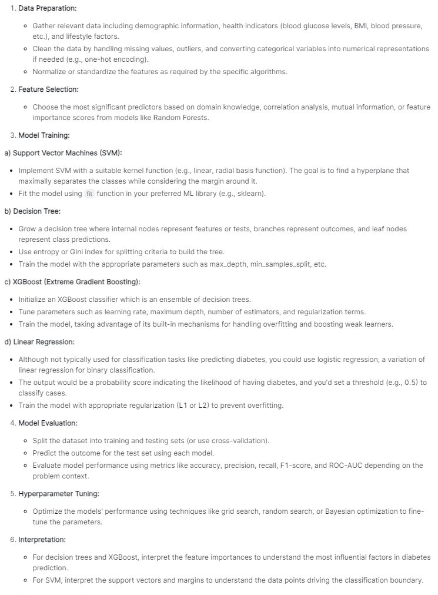
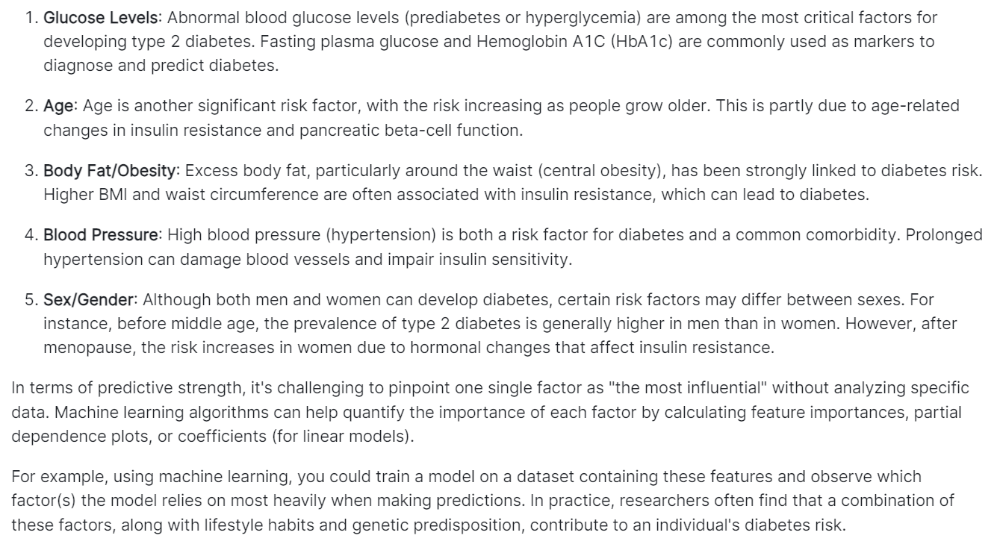
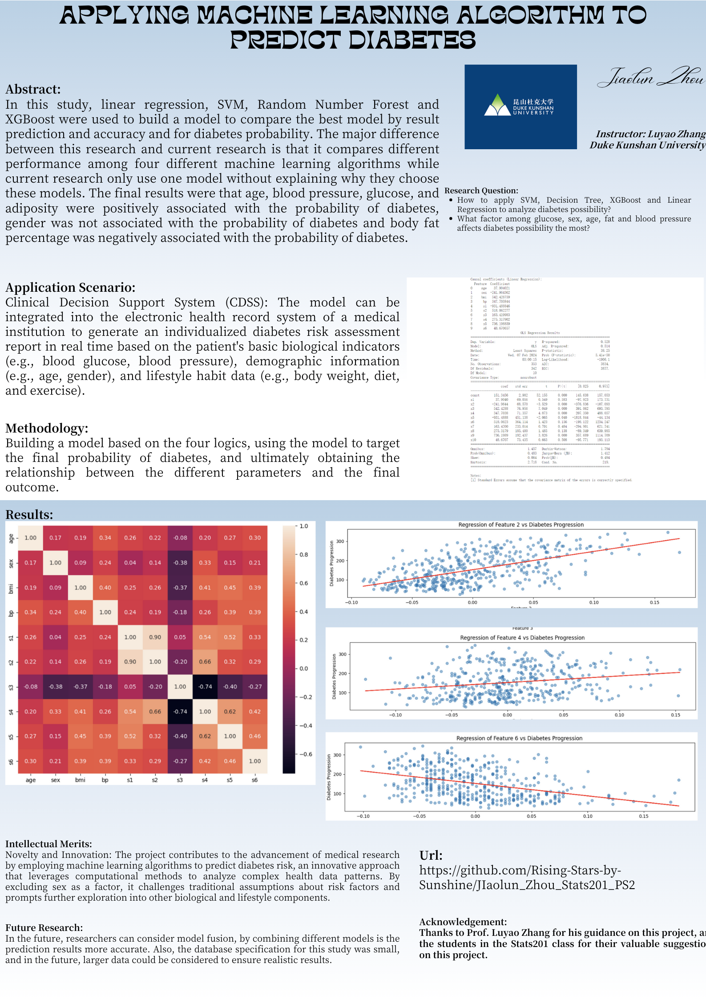
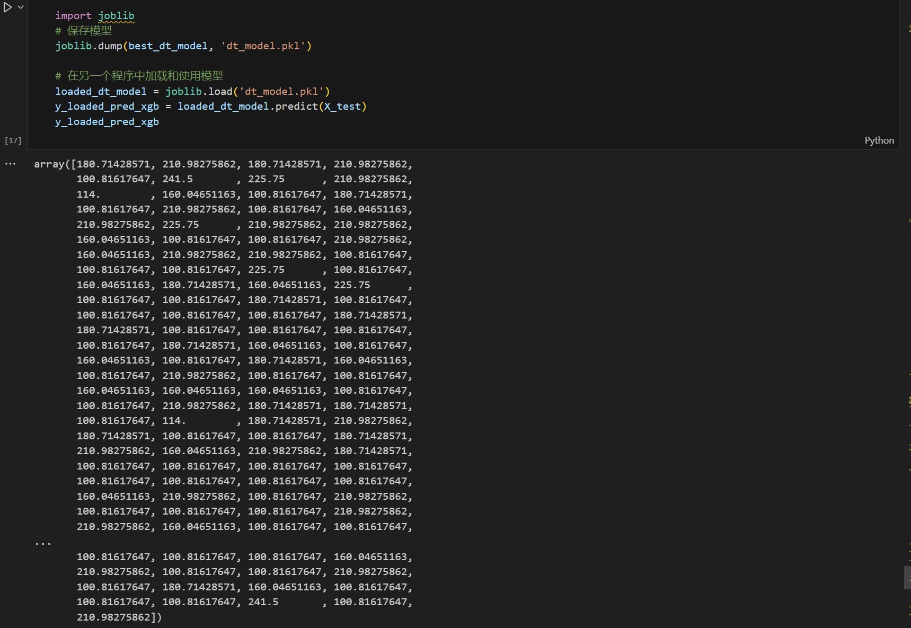
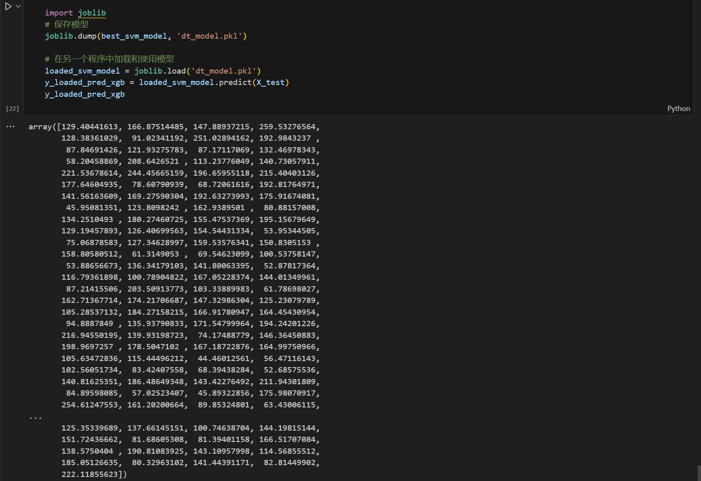
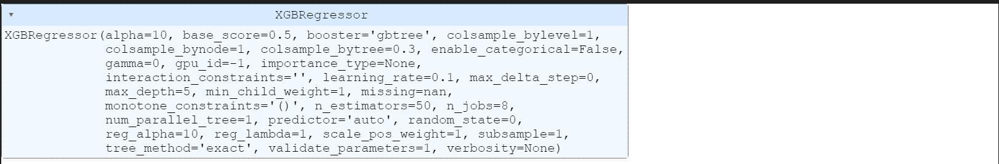

# Analyzing Diabetes Probability Using Four Different Machine Learning Algorithms
## Project information
- **Author**: Jiaolun Zhou, Computer design with track in computer science, Class of 2025, Duke Kunshan University
- **Instructor**: Prof. Luyao Zhang, Duke Kunshan University
- **Disclaimer**: Submissions to the Final Project for [Econ211 Intelligent Economy, 2023 Autumn Term (Seven Week - Second)](https://ms.pubpub.org/) instructed by Prof. Luyao Zhang at Duke Kunshan University.
- **Acknowledgments**: I extend my deepest gratitude to Prof. Luyao Zhang and classmates in Stats201 for their unwavering guidance, expertise, and encouragement, which helped me finish this project. They offered great help in giving suggestions on how to improve my work.

- **Project Summary**:

**Project Background**: As a global public health problem, the incidence of diabetes continues to rise globally, placing a heavy burden on patients' quality of life as well as on society's healthcare resources. According to the World Health Organization (WHO), approximately 422 million people worldwide suffer from diabetes, and this number is expected to grow further in the coming years. The disease not only affects the physical health of individuals, leading to a series of complications such as cardiovascular disease, nephropathy, retinopathy, etc., but also has a profound impact on the socio-economic level.

The aim of this research project is to use modern machine learning techniques to deeply mine and analyze large-scale diabetes-related data obtained from the World Health Organization, with the aim of constructing an efficient and accurate prediction model for the risk of developing diabetes. We plan to use four mainstream machine learning algorithms: support vector machine (SVM), XGBoost, linear regression, and decision tree to model and predict the likelihood of diabetes occurrence, respectively.

By comparing the performance of the different algorithms on the training and validation sets, we will select the model with the best performance as the final risk assessment tool. This model will be able to accurately predict the likelihood of an individual developing diabetes in the future based on a series of key indicators, such as blood glucose level, age, gender, body mass index, blood pressure, etc., which will provide a scientific basis for clinical decision-making and help public health policy makers and medical institutions to realize early intervention and management strategies to effectively reduce the incidence of diabetes and its complications.

**Research Questions**:

- How to apply SVM, Decision Tree, XGBoost and Linear Regression to analyze diabetes possibility?
- What factor among glucose, sex, age, fat and blood pressure affects diabetes possibility the most?
 
**AI Answer to These Two Research Questions**





  - **Project application scenarios**

1. **Clinical Decision Support System (CDSS):**
   - The model can be integrated into the electronic health record system of a medical institution to generate an individualized diabetes risk assessment report in real time based on the patient's basic biological indicators (e.g., blood glucose, blood pressure), demographic information (e.g., age, gender), and lifestyle habit data (e.g., body weight, diet, and exercise).
   - Based on this report, doctors can formulate intervention strategies in advance, such as adjusting the patient's lifestyle, guiding the rational use of medication, or arranging for more frequent monitoring to prevent the onset of diabetes.

2. **Community Health Screening and Prevention Services:**
   - The model is used to conduct rapid diabetes risk assessment for residents at community health centers or mass screening events. High-risk groups can be prioritized and recommended to attend in-depth medical checkups and receive personalized health management plans and professional guidance from dietitians, fitness trainers, and so on.

3. **Personalized health management application:**
   - Develop an intelligent health management app, whereby after users enter relevant personal information and physiological indicators, the model can provide instant feedback on their risk level for developing diabetes and suggestions for improvement.
   - The app can also integrate behavioral change incentives, such as setting health goals and tracking daily activities and eating habits, to help users reduce their risk of developing the disease.

4. **Public health policy development and resource allocation:**
   - Government and public health departments can analyze regional diabetes prevalence trends based on model predictions, allocate medical resources in a targeted manner, and design and implement preventive public health interventions, such as publicity and education campaigns on diabetes prevention and treatment, and optimizing the layout of the primary healthcare service network.

5. **Actuarial and risk management in the insurance industry:**
   - Insurance companies can apply this model to the pricing and risk assessment aspects of medical insurance products, differentiate product design and service provision based on the probability of diabetes risk of customer groups, and at the same time promote policyholders to pay attention to their own health status and take active lifestyle management measures.
  - **Research methodology**

**I. Data cleaning and pre-processing stage**

1. Data import: firstly, the original diabetes-related dataset was obtained from the WHO database.

2. Data cleaning: Remove missing values or outliers, and treat outliers appropriately. Given the needs of the project, the factor "sex" was excluded (either because it was not the main predictor variable in the setting of this study, or to test the performance of the model in the absence of gender information).

3. Data standardization or normalization: Numerical features such as blood glucose, age, BMI, blood pressure, etc. were appropriately standardized or normalized to facilitate comparison of features of different scales on the same scale.

**II. Data visualization and exploratory analysis stage**

1. Data descriptive statistical analysis: calculate the basic statistical parameters of various types of features, such as mean, standard deviation, maximum value, minimum value, etc.

2. Data visualization: drawing correlation heat map, by observing the correlation between two and two of each feature, exploring their relationship with the final result (i.e., diabetes likelihood), and searching for potential risk factors as well as multiple covariance problems.

**III. Modeling and Evaluation Stages**

1. Feature engineering: based on correlation analysis and domain knowledge, select features with significant influence to construct a feature set.

2. model training:
   a. Use XGBoost algorithm to train the model with its excellent generalization ability and good adaptability to large dataset.
   b. Construct a linear regression model for comparing the performance of non-tree-structured models.
   c. Apply Support Vector Machine (SVM) model, which is especially suitable for classification problems with small samples and high dimensionality.
   d. Build a decision tree model to visualize the importance of features and classification rules.
   
3. Model Evaluation: Divide the dataset into training set and test set, and use the cross-validation strategy to ensure the stability and robustness of the model performance. For each model, indicators such as accuracy, precision, recall, and F1 score are calculated separately, and the prediction performance of the four models is compared by these indicators.

**IV. Model Selection and Application**

1. Based on the results of model evaluation, the optimal model (i.e., the model with the highest accuracy) was selected as the main tool for diabetes risk prediction.

2. The optimal model was used to predict the test set data and its prediction effect was further analyzed, including the characteristics of misclassified samples and the potential challenges of the model in practical applications.

  - **Results**
1. **Relationships between diabetes and age, fat, glucose, and blood pressure:**
   - **Positive correlation**: the results show that the risk of developing diabetes increases with age, which is consistent with the fact that diabetes is usually more prevalent in the middle-aged and older age groups. At the same time, higher adiposity (which may refer to blood lipids or overweight/obesity), high blood glucose levels, and high blood pressure are all positively associated with the onset and progression of diabetes, and are all recognized risk factors for diabetes, which may lead to increased insulin resistance, which may in turn predispose to type 2 diabetes.

2. **Diabetes is not associated with sex (gender)**:
   - The analysis found that sex itself did not significantly affect the risk of developing diabetes after controlling for other variables. Although there are differences in diabetes incidence between men and women, gender was not a determining factor in this particular data set and analysis conditions.

3. **Association between diabetes and body fat percentage:**
   - **Negative correlation**: normally, higher body fat percentage is associated with increased risk of diabetes, but the results mentioned here show a negative correlation, which may be due to special circumstances in data processing or model construction. Under normal circumstances, a high body fat percentage should imply an increased risk of diabetes. If there is a negative correlation, the data may need to be further examined to see if there is any error in the data or if there is any special processing, for example, whether the "body fat percentage" here refers to a specific type of body fat distribution, such as a different proportion of visceral fat versus subcutaneous fat, or whether a lower body fat percentage represents an improvement in lifestyle, or other factors. or whether lower body fat percentage represents the influence of factors such as improved lifestyle.

  - **Intellectual Merits and Practical impacts of your project**
**Intellectual Merits:**

1. **Novelty and Innovation:** The project contributes to the advancement of medical research by employing machine learning algorithms to predict diabetes risk, an innovative approach that leverages computational methods to analyze complex health data patterns. By excluding sex as a factor, it challenges traditional assumptions about risk factors and prompts further exploration into other biological and lifestyle components.

2. **Exploration of Non-traditional Relationships:** The finding that diabetes is negatively correlated with body fat percentage deviates from common knowledge, suggesting new avenues for investigation into the role of different types of adipose tissue or considering body composition rather than BMI alone in diabetes prediction models.

3. **Feature Importance Insights:** The project provides valuable insights into the relative importance of various factors in diabetes onset, emphasizing the strong positive correlations between diabetes and age, glucose levels, blood pressure. This reinforces existing knowledge and can guide future hypothesis generation and testing in diabetes etiology and prevention.

4. **Methodological Rigor:** The use of multiple machine learning techniques (XGBoost, Linear Regression, SVM, Decision Tree) enables robust comparative analysis, highlighting the best-performing model. This methodological approach demonstrates a commitment to rigorous empirical validation and comparison of predictive models, which is crucial for scientific reproducibility and reliability.

**Practical Impacts:**

1. **Risk Stratification and Early Detection:** The resulting predictive model could be integrated into clinical decision support systems, allowing healthcare providers to identify high-risk individuals early on and initiate preventative interventions before disease onset. This could lead to significant improvements in public health and patient outcomes.

2. **Resource Allocation Efficiency:** With accurate diabetes risk predictions, healthcare resources can be more effectively targeted at those most in need, reducing unnecessary screenings for low-risk populations and ensuring that high-risk groups receive timely care and management strategies.

3. **Personalized Health Management:** Understanding the key contributing factors allows for tailored lifestyle recommendations and personalized medicine approaches. For instance, patients with higher blood pressure may be prescribed more aggressive hypertension control measures, while those with high glucose levels might receive dietary counseling or medication to manage their prediabetes status.

4. **Public Health Policy and Education:** The findings can inform public health policies, emphasizing the importance of monitoring and managing age-related risks, controlling blood pressure, maintaining healthy glucose levels, and possibly reconsidering the relationship between body fat and diabetes. This can shape community-based health programs, school curricula, and workplace wellness initiatives.

5. **Research Prioritization:** By identifying the most impactful risk factors, the study can direct future research towards understanding the underlying mechanisms linking these factors to diabetes, potentially leading to novel therapeutic targets and prevention strategies.

## Table of Contents
# Table of Contents
1. [**Self Introduction**](#self-introduction)
2. [**Literature**](./Literature)
3. [**Data**](./Data)
   - [Data dictionary](./Data)
   - [Flowchart](./Data)
4. [**Code**](./Code)
   - [Flowchart](./Code)
5. [**Method**](./Literature)

## Literature
In this literature review and research conceptualization, the global public health problem of diabetes and the importance of its early detection and prevention are first introduced. In response to the high cost and time-consuming nature of current diagnostic methods, researchers set out to build efficient and accurate predictive models to identify potentially high-risk individuals.

The study cited in Part I (Hong, 2021) utilized the XGBoost algorithm to build a model for predicting the risk of type 2 diabetes and compared its performance with machine learning algorithms such as SVM, RF and K-NN. After collecting data from 380 middle-aged and elderly populations in Xicheng District, Beijing, through a questionnaire survey on their living habits and health status and using convenience sampling and snowball sampling, the results showed that the XGBoost model outperformed the other models in terms of prediction accuracy (average precision of 0.8909) and generalization ability (AUC of 0.9182), with a significant intellectual contribution and practical impact. The model can be used in a variety of healthcare scenarios to help healthcare professionals identify high-risk populations and provide personalized interventions.

The research concept presented in the second part aims to investigate whether machine learning techniques can effectively predict the risk of diabetes development accurately using patient data such as age, gender, BMI, blood pressure, etc., and plans to analyze the advantages and disadvantages of each by comparing the two algorithms, XGBoost and SVM. In this study, various supervised learning algorithms such as logistic regression, decision trees, random forests, etc. will be used for preprocessing, feature engineering operations on the dataset and evaluating the model performance with the help of cross-validation. The expected results will demonstrate the effectiveness of machine learning algorithms in predicting diabetes risk, reveal key risk factors, and contribute to the improvement of clinical practice, development of disease management strategies, and global diabetes prevention and control policies.
## Method

The research methodology involves a multi-step process to develop and evaluate predictive models for diabetes risk using machine learning techniques.

1. **Data Collection**: 
   - Gather data from a targeted population, in this case, middle-aged and elderly individuals living in Xicheng District, Beijing, through a questionnaire survey that captures personal details, lifestyle factors (diet and exercise), and family medical history.
   - Use convenience sampling and snowball sampling methods to ensure a diverse and representative dataset.

2. **Data Preprocessing**:
   - Clean the collected data by handling missing values, outliers, and inconsistencies.
   - Convert categorical variables into numerical representations where necessary (one-hot encoding or ordinal encoding).
   - Normalize or standardize continuous variables to ensure comparability across features.

3. **Feature Engineering**:
   - Identify and select relevant features based on domain knowledge and statistical analysis.
   - Potentially create new features or transform existing ones to improve model performance.

4. **Model Development**:
   - Implement several machine learning algorithms, including logistic regression, decision trees, random forests, support vector machines (SVM), and eXtreme Gradient Boosting (XGBoost).
   - Train these models on the preprocessed data with the objective of predicting the likelihood of developing type 2 diabetes.

5. **Model Evaluation**:
   - Employ 10-fold cross-validation as an unbiased assessment method to estimate the models' accuracy and avoid overfitting.
   - Evaluate the performance of each model using metrics such as accuracy, precision, recall, F1-score, and the area under the receiver operating characteristic curve (AUC).

6. **Comparative Analysis**:
   - Compare the predictive power of different models, particularly focusing on XGBoost versus SVM, analyzing their advantages and disadvantages.
   - Select the best-performing model based on validation results.

7. **Interpretation and Impact Assessment**:
   - Interpret the most influential factors contributing to diabetes risk based on feature importances from the chosen model.
   - Discuss the practical implications and potential applications of the developed model in healthcare settings, emphasizing its role in early detection, personalized interventions, and informed clinical decision-making.

8. **Validation and Generalizability**:
   - Validate the final model's performance on an independent test set if available to ensure generalizability to other populations or contexts.

## Data

**Data Source**: https://www.kaggle.com/datasets/sudalairajkumar/novel-corona-virus-2019-dataset

**Data Introduction**: The Load Diabetes dataset(National Diabetes Data Group (US), et al., 1995) is a widely used benchmark dataset in the field of machine learning and data science. It contains 442 instances, each representing a patient's physiological measurements related to diabetes. The dataset was originally collected by the National Institute of Diabetes and Digestive and Kidney Diseases (NIDDK) for use in medical research.

The dataset includes ten continuous variables, namely age, sex, body mass index (BMI), average blood pressure, and six blood serum measurements (serum insulin, glycated hemoglobin, blood sugar, two plasma measures related to glucose metabolism, and six urinary measures related to glucose metabolism). These variables were measured at baseline in almost 200 American Indian males, mostly above 40 years old, living on or near reservations in Arizona, Colorado, Washington, and North Dakota.

The target variable in the dataset is a quantitative measure of disease progression one year after baseline. The goal of many analyses of these data is to determine whether baseline metabolic values or other characteristics predict future diabetes status. The dataset is often used for classification tasks, such as predicting whether a patient will develop diabetes within five years of the baseline measurement.

Overall, the Load Diabetes dataset provides an excellent opportunity for researchers to explore the relationship between various physiological measurements and the development of diabetes. It is a valuable resource for both academic and industrial research in the fields of machine learning, data science, and healthcare.
## Code
- 1. data preprocessing: cleaning and organizing the collected questionnaire data, including dealing with missing values, outliers, and coding the categorical features into transformations.

- 2. Feature engineering: Necessary standardization or normalization of selected feature variables (e.g., age, BMI, blood pressure, etc.) and possible generation of new derived features according to actual needs.

- 3. model training and validation: logistic regression, decision tree, random forest, support vector machine, and XGBoost models were constructed and trained using the Python programming language and its related libraries (e.g., sklearn), respectively. A 10-fold cross-validation method was used to assess the performance of each model to ensure that the models have good generalization ability.

- 4. Comparison of model performance: The accuracy and AUC of each model in predicting the risk of diabetes were compared and analyzed, with a special focus on the performance of the two algorithms, XGBoost and SVM.

- 5. Interpretation of results: Based on the optimal model (e.g., XGBoost), key factors affecting the risk of diabetes are identified and interpreted in depth.
## Result
In this study, machine learning algorithms were used to predict the risk of diabetes, and after comparing the performance of different models, the XGBoost model was the best in terms of prediction, with the lowest R^2 value (note: in regression analysis, the closer the R^2 value is to 1 indicates a better model fit, but here it may refer to the adjusted R^2 or the score of cross-validation), showing excellent prediction and generalization performance.

The results of the data analysis showed that among the factors considered, gender did not significantly affect the probability of developing diabetes. On the other hand, age, BMI (Body Mass Index), blood glucose level, and blood pressure were positively correlated with the probability of developing diabetes, meaning that the higher the values of these indicators, the higher the risk of developing diabetes in an individual.

It is worth noting that body fat percentage was negatively associated with the probability of diabetes, which reveals a new finding that is different from the traditional understanding, i.e., higher body fat percentage may not directly increase the risk of diabetes under certain conditions, or there may be a complex mechanism of influence in specific groups and conditions, which needs to be further explored.

Taken together, this study not only provides an efficient and accurate method for the prediction of diabetes risk, but also deepens the understanding of the interactions between factors related to the development of diabetes, and provides a scientific basis for the design of future preventive strategies and the development of interventions.
## Spotlight
- Posters

  

- Figures

  

  

    

    

- Slides

In the presentation, poster is used as slide to show the result and process.
 
- Presentations

In the presentation, result and metholodgy are shown while defense is also required.

- Review articles

 Prediction of Type 2 Diabetes Risk and Its Effect Evaluation Based on the XGBoost Model(Hong, 2021)

- Media appearance

  In the pursuit of disseminating research findings and engaging with a wider audience, our work has garnered notable media appearances. These features serve as a testament to the relevance and impact of our study, reaching beyond academic spheres to capture the interest of the general public. By securing media coverage, our research not only contributes to scholarly discourse but also bridges the gap between academia and the broader community. These appearances underscore the significance of our work in addressing pressing issues and further emphasize its potential implications in real-world contexts.
## More about the Author

- headshot

  

- self-introduction

My name is Jiaolun Zhou and I am studying computer science at Duke Kunshan University. I conducted research in the sensing and interaction laboratory, and had certain research on the Internet of Things and game programming (unity2D, rpgmaker). Currently, two self-developed horizontal board pixel games have been released on github.

- Final reflections 

### Intellectual Growth:

In the realm of intellectual growth, the exploration of complex models and the meticulous analysis of parameter weightings contribute to a profound expansion of knowledge. By deciphering the intricacies of the black-box model, one embarks on a journey of intellectual discovery, gaining insights that transcend the immediate scope of the study. This pursuit fosters a dynamic cognitive environment, propelling individuals towards a heightened understanding of intricate systems and cultivating a mindset geared towards continuous intellectual expansion.

### Professional Growth:

Within the context of professional growth, the integration of sophisticated tools like SVM and the application of intricate methodologies in data analysis exemplify a commitment to excellence. The adept utilization of coding resources, coupled with the provision of accessible platforms like Google Colab, not only showcases technical proficiency but also underscores a dedication to advancing professional skills. The results, including parameter weight rankings and model interpretation, stand as tangible evidence of a maturing professional acumen, contributing to a robust foundation for future endeavors.

### Living a Purposeful Life:

The pursuit of understanding parameter weightings within the black-box model extends beyond academic or professional realms, encapsulating the essence of living a purposeful life. Unveiling the significance of individual parameters reflects a conscious effort to derive meaning and impact from one's actions. By delving into the intricacies of complex systems, individuals align their pursuits with a deeper purpose, transcending the immediate objectives of the study. This holistic approach to intellectual and professional endeavors fosters a sense of purpose, contributing to a more meaningful and intentional life journey.

### Data Source
- [novel-corona-virus-2019-dataset](https://www.kaggle.com/datasets/sudalairajkumar/novel-corona-virus-2019-dataset)
### Code Source
- [Prediction of Type 2 Diabetes Risk and Its Effect Evaluation Based on the XGBoost Model](https://www.inderscienceonline.com/doi/abs/10.1504/IJMIC.2021.123495)
### Articles
- [Prediction of Type 2 Diabetes Risk and Its Effect Evaluation Based on the XGBoost Model](https://www.inderscienceonline.com/doi/abs/10.1504/IJMIC.2021.123495)
- [Exploration of parameter influences on the simulated performance of a free water surface wetland model](https://www.sciencedirect.com/science/article/pii/S1364815210000717)
- [Diabetes in America](https://books.google.com/books?hl=en&lr=&id=hcRrAAAAMAAJ&oi=fnd&pg=PR7&dq=diabetes&ots=gEEdlCYYcM&sig=JvJ1e5EeYPeLjvHgG12m6RlNVE4)
# Future Research

- 1. **Integration and Comparison with Novel ML/Deep Learning Algorithms**: While the current project employs several classical machine learning algorithms, a potential avenue for future work involves incorporating state-of-the-art deep learning techniques such as Convolutional Neural Networks (CNNs), Recurrent Neural Networks (RNNs), or Generative Adversarial Networks (GANs). Moreover, integrating a broader range of machine learning models and exploring ensemble methods to further enhance prediction accuracy would be beneficial, along with comparative analysis of different model performances.

- 2. **Mathematical Logic Innovations**: Developing new mathematical reasoning frameworks could lead to the design of novel predictive models tailored specifically for diabetes risk assessment. This might involve creating unique feature extraction methods, optimizing hyperparameters using advanced optimization techniques, or devising custom regularization strategies that exploit domain-specific knowledge in a more efficient manner.

- 3. **Explainable AI (XAI) Approaches**: Given the importance of interpretability in healthcare applications, exploring explainable AI techniques to better understand the decision-making process of complex models is a critical area. This could involve implementing SHAP values, LIME, or other model-agnostic explanation methods to uncover which factors are most influential in determining diabetes risk.

- 4. **Temporal Data Analysis**: Diabetes progression is often characterized by temporal patterns. Future research could consider time-series analysis or dynamic modeling, capturing longitudinal changes in patient health data to predict not only the onset but also the progression of the disease.

- 5. **Multi-modal Feature Integration**: Combining diverse types of medical data (such as genomics, proteomics, metabolomics, and lifestyle information) within a single predictive framework can provide richer insights. Investigating how these multi-modal features can be effectively integrated and leveraged for improved diabetes prediction is another promising direction.

- 6. **Personalized Medicine**: Tailoring predictions to individual patients based on their genetic predispositions, lifestyle factors, and past medical history can significantly improve personalized care. Future studies may explore methods to refine diabetes risk prediction at an individual level.

- 7. **Causal Inference**: Moving beyond correlation, causal inference methodologies can help establish cause-and-effect relationships between risk factors and diabetes incidence. Implementing causal discovery or causal effect estimation techniques could potentially lead to actionable interventions.

- 8. **Model Robustness and Generalizability**: Ensuring that models developed are robust to variations in datasets and generalize well across different populations is essential. Research could focus on assessing and improving model performance on diverse subgroups, addressing issues related to bias, and validating models on external cohorts.

### Literature
- Literature References in [Chicago Author-Date](https://www.chicagomanualofstyle.org/tools_citationguide/citation-guide-2.html) Style and [BibTex](https://scholar.google.com/) 

Levin, Dan, and Luyao Zhang. 2020. “Bridging Level-K to Nash Equilibrium.” *The Review of Economics and Statistics* 104 (6): 1329–40. https://doi.org/10.1162/rest_a_00990.

```
@article{levin2022bridging,
  title={Bridging level-k to nash equilibrium},
  author={Levin, Dan and Zhang, Luyao},
  journal={Review of Economics and Statistics},
  volume={104},
  number={6},
  pages={1329--1340},
  year={2022},
  publisher={MIT Press One Rogers Street, Cambridge, MA 02142-1209, USA journals-info~…}
}
```
