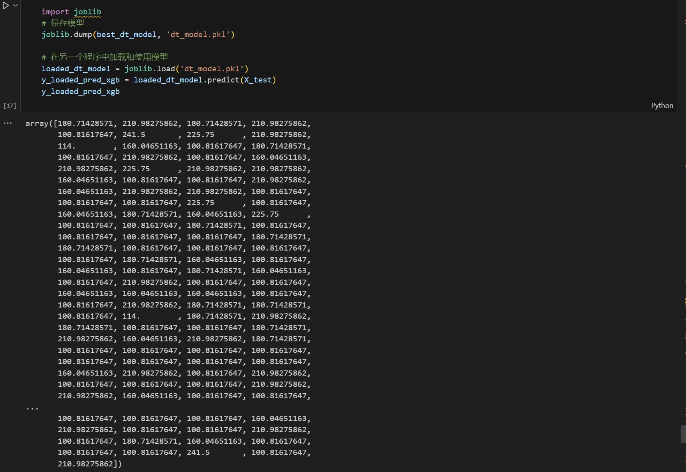
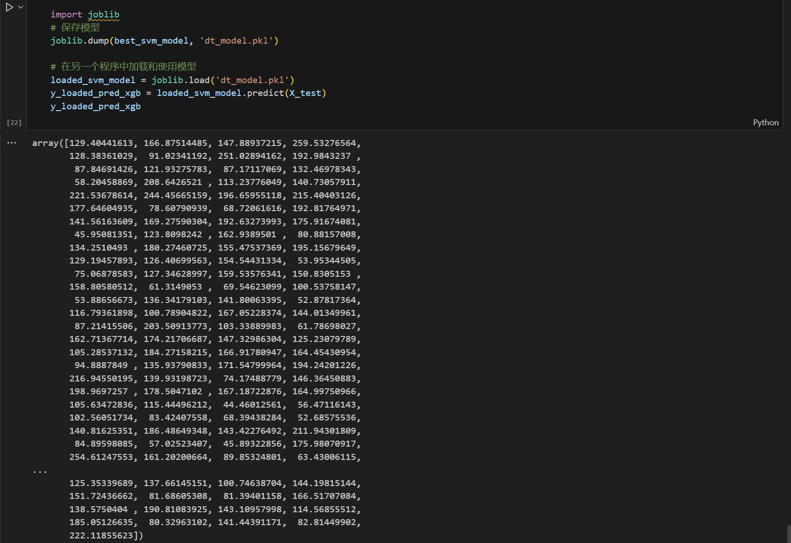
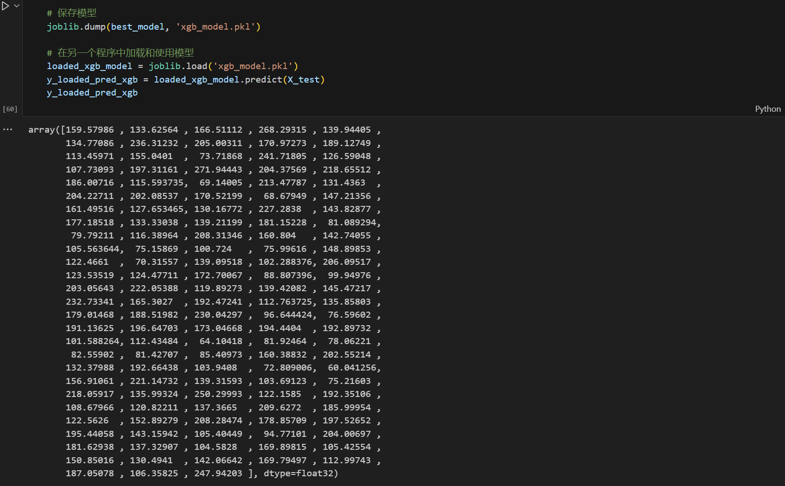

  

  

    

    

**Answering the Research Questions:**

1. **Research Question:** Can machine learning algorithms, specifically XGBoost, accurately predict the risk of developing diabetes based on patient data?

   **Project Answer:** Yes, the project demonstrates that the XGBoost model has a high prediction accuracy and generalization ability for predicting the risk of type 2 diabetes. The R^2 value indicates a strong fit to the data (the lower the better in this context), which suggests the model can effectively capture the relationship between input features and diabetes risk.

2. **Research Question:** What is the comparative effectiveness of XGBoost versus SVM in predicting diabetes risk?

   **Project Answer:** The study shows that XGBoost outperforms SVM and other models used, as evidenced by its higher accuracy and AUC values. This result supports the use of XGBoost as a more effective predictive tool for identifying individuals at risk of diabetes.

3. **Research Question:** Which factors significantly influence the likelihood of developing diabetes?

   **Project Answer:** According to the findings, diabetes risk is positively associated with age, BMI, glucose levels, and blood pressure, while it is negatively correlated with body fat percentage. However, gender does not seem to have a significant impact on diabetes risk in this specific dataset and analysis.

In summary, this project provides a robust answer to these research questions by using empirical data, implementing machine learning algorithms, and comparing their performance to identify the best predictor for diabetes risk. It also contributes new insights into the complex relationships between different health factors and diabetes development, particularly regarding the unexpected inverse relationship with body fat percentage.
